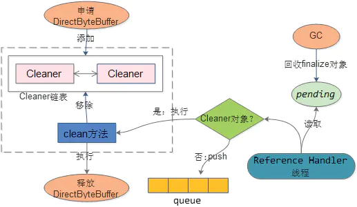

### 堆外内存的分配与回收

ByteBuffer.java
```java
// 分配一个新的直接字节缓冲区
// 新缓冲区的位置将为0，其极限将为其容量，它的标记将是未定义的，它的每个元素将是初始化为零.不管它有没有
public static ByteBuffer allocateDirect(int capacity) {
    return new DirectByteBuffer(capacity);
}
```

DirectByteBuffer.java
```java
class DirectByteBuffer extends MappedByteBuffer implements DirectBuffer {
    DirectByteBuffer(int cap) {
        super(-1, 0, cap, cap);
        boolean pa = VM.isDirectMemoryPageAligned();
        int ps = Bits.pageSize();
        long size = Math.max(1L, (long)cap + (pa ? ps : 0));
        Bits.reserveMemory(size, cap);
    
        long base = 0;
        try {
            // 真正申请内存
            base = unsafe.allocateMemory(size);
        } catch (OutOfMemoryError x) {
            Bits.unreserveMemory(size, cap);
            throw x;
        }
        unsafe.setMemory(base, size, (byte) 0);
        if (pa && (base % ps != 0)) {
            address = base + ps - (base & (ps - 1));
        } else {
            address = base;
        }
        // 创建Cleaner对象
        cleaner = Cleaner.create(this, new Deallocator(base, size, cap));
        att = null;
    }
    
    private static class Deallocator implements Runnable {
        private static Unsafe unsafe = Unsafe.getUnsafe();

        private long address;
        private long size;
        private int capacity;

        private Deallocator(long address, long size, int capacity) {
            assert (address != 0);
            this.address = address;
            this.size = size;
            this.capacity = capacity;
        }

        public void run() {
            if (address == 0) {
                return;
            }
            // native方法，真正回收对外内存
            unsafe.freeMemory(address);
            address = 0;
            Bits.unreserveMemory(size, capacity);
        }
    }
}
```

Cleaner.java
```java
// Cleaner对象采用链表的数据结构
public class Cleaner extends PhantomReference<Object> {
    // 存放Reference对象Pending状态的队列
    private static final ReferenceQueue<Object> dummyQueue = new ReferenceQueue();
    private static Cleaner first = null;
    private Cleaner next = null;
    private Cleaner prev = null;
    private final Runnable thunk;

    private static synchronized Cleaner add(Cleaner var0) {
        if (first != null) {
            var0.next = first;
            first.prev = var0;
        }
    
        first = var0;
        return var0;
    }
    
    public static Cleaner create(Object var0, Runnable var1) {
        return var1 == null ? null : add(new Cleaner(var0, var1));
    }
    
    private Cleaner(Object var1, Runnable var2) {
        // 继承于PhantomReference，而PhantomReference是Reference的子类，所以实际调用的是Reference的构造方法
        super(var1, dummyQueue);
        this.thunk = var2;
    }

    // 真正释放堆外内存，在守护线程执行tryHandlePending时调用
    // 实际是调用Runnable的thunk对象去执行
    public void clean() {
        if (remove(this)) {
            try {
                this.thunk.run();
            } catch (final Throwable var2) {
                AccessController.doPrivileged(new PrivilegedAction<Void>() {
                    public Void run() {
                        if (System.err != null) {
                            (new Error("Cleaner terminated abnormally", var2)).printStackTrace();
                        }
                        // 强制退出
                        System.exit(1);
                        return null;
                    }
                });
            }

        }
    }
}
```

Reference.java
```java
public abstract class Reference<T> {
    /* 实例内部存在四种可能的状态：
     * Active:
     *   受到垃圾回收器的特殊处理。一些时间采集器检测到后的可达性，当referent改变到适当的状态时，它将实例的状态改变为Pending或Inactive，具体取决于实例是否在队列中注册创建。
     *   当为queue方式时，它还将实例添加到pending-Reference列表。新创建的实例是Active的。
     *
     * Pending：挂起引用列表中等待被删除的元素，由引用处理程序线程加入队列。
     *
     * Enqueued：实例所在队列的元素，在创建时注册。当从一个实例中移除时，它的状态将被设为Inactive。
     *
     * Inactive：非活动状态，表示内存可以被释放
     */

    // queue参数
    //      当null时，则不存在Pending、Enqueued状态，会直接由Active转变为Inactive
    //      当queue时，则状态变化为Active-》Pending-》Enqueued-》Inactive
    Reference(T referent, ReferenceQueue<? super T> queue) {
        this.referent = referent;
        this.queue = (queue == null) ? ReferenceQueue.NULL : queue;
    }


    // 尝试处理pending
    static boolean tryHandlePending(boolean waitForNotify) {
        Reference<Object> r;
        Cleaner c;
        try {
            synchronized (lock) {
                if (pending != null) {
                    r = pending;
                    // instanceof 有时会抛出OutOfMemoryError，这里解除r对象跟pending的联系
                    c = r instanceof Cleaner ? (Cleaner) r : null;
                    pending = r.discovered;
                    r.discovered = null;
                } else {
                    if (waitForNotify) {
                        lock.wait();
                    }
                    return waitForNotify;
                }
            }
        } catch (OutOfMemoryError x) {
            Thread.yield();
            return true;
        } catch (InterruptedException x) {
            return true;
        }

        if (c != null) {
            // 调用Cleaner类的clean方法
            c.clean();
            return true;
        }

        ReferenceQueue<? super Object> q = r.queue;
        // 将Pending状态转变为Enqueued状态，然后由Enqueued方法再转变为Inactive状态
        if (q != ReferenceQueue.NULL) q.enqueue(r);
        return true;
    }

    // 开启一个守护线程监控处理Reference.pending队列
    static {
        ThreadGroup tg = Thread.currentThread().getThreadGroup();
        for (ThreadGroup tgn = tg;
             tgn != null;
             tg = tgn, tgn = tg.getParent());
        Thread handler = new ReferenceHandler(tg, "Reference Handler");
        handler.setPriority(Thread.MAX_PRIORITY);
        handler.setDaemon(true);
        handler.start();

        SharedSecrets.setJavaLangRefAccess(new JavaLangRefAccess() {
            @Override
            public boolean tryHandlePendingReference() {
                return tryHandlePending(false);
            }
        });
    }
}
```





