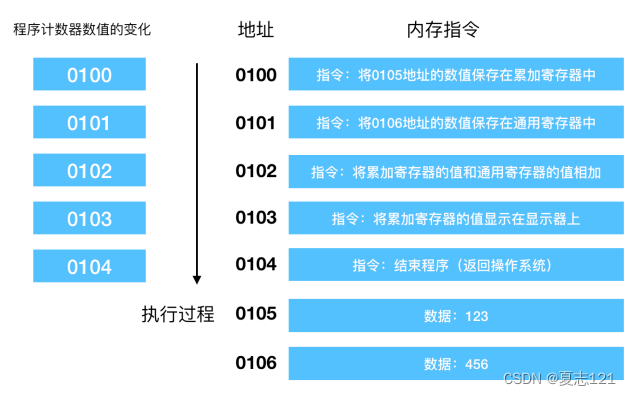
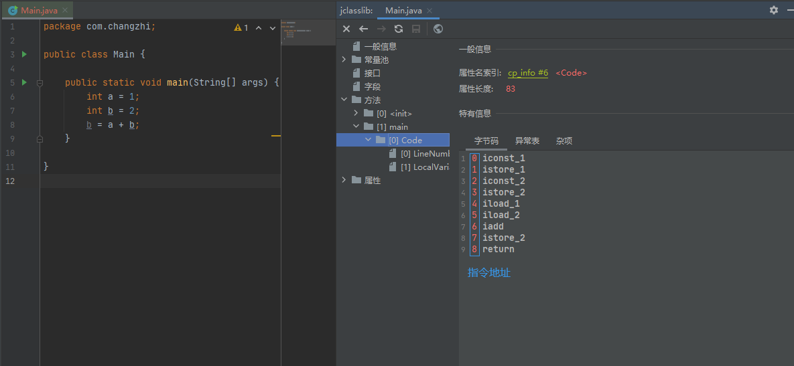
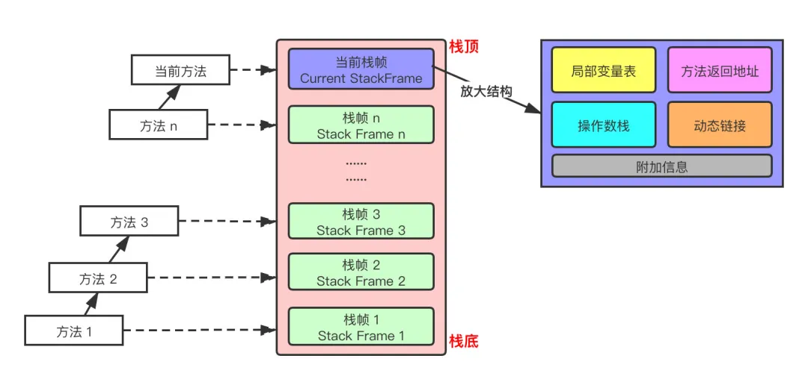
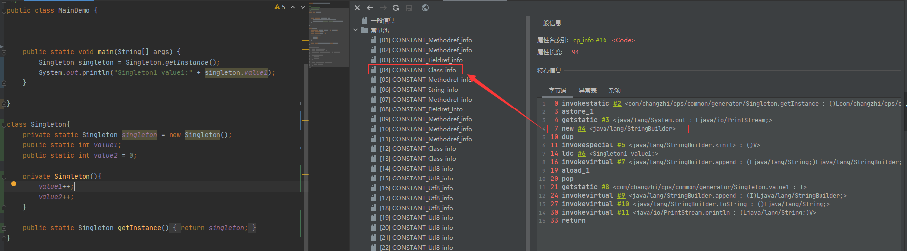
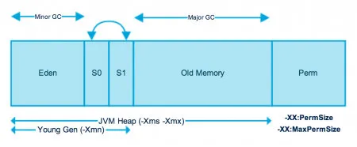
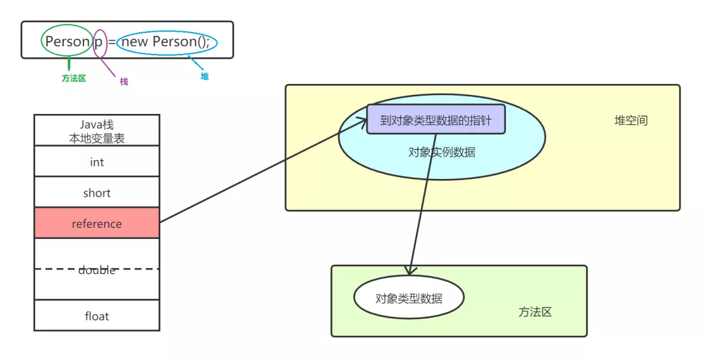
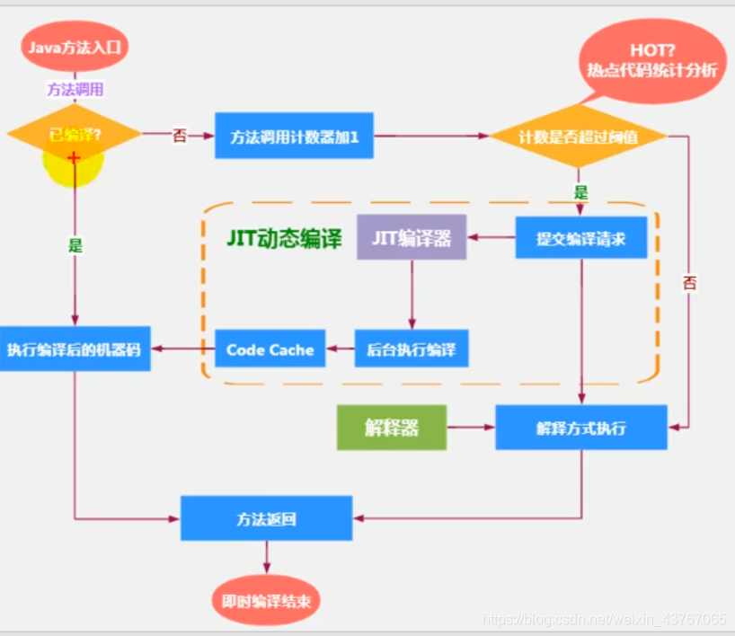
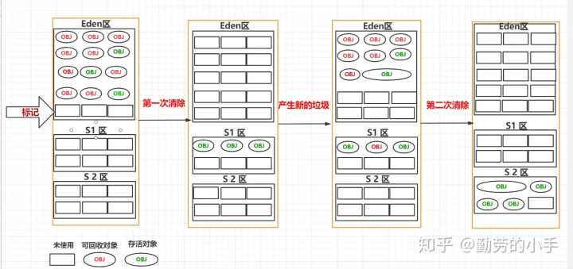
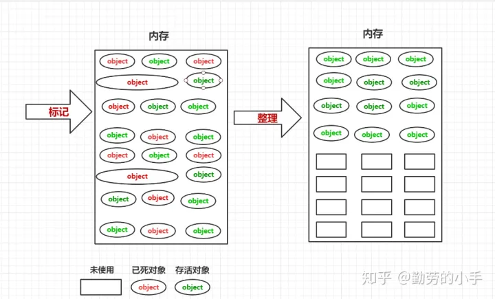

## JVM


### Class Loader SubSystem - 类装载子系统
类装载子系统，主要负责对编译后的class文件进行数据的加载、链接（验证、准备、解析）、初始化等步骤，最终形成可以被虚拟机直接使用的 java.lang.Class，并存储在相应的位置：
- jdk1.8之前：存储在**方法区**中
- jdk1.8及之后：存储在**堆和元空间**中

整个过程中，除了解析外，加载、验证、准备、初始化（、卸载）这几个阶段，顺序是确定的，但并不一定是等到上一个阶段完成才继续下一个阶段，这些阶段通常是相互交叉地混合进行。而解析阶段，考虑到Java语言的**运行时绑定**，有时是在初始化之后才进行。


#### 加载阶段
Java语言的类型分为两大类：基础类型、引用类型
- 基础类型：由虚拟机预先定义好，不会经历单独的类加载过程
- 引用类型（类、接口、数组类、泛型参数）：除泛型参数外的类型都会经历链接、初始化的过程
    - 类、接口：有对应的字节流，需借助**类加载器**来完成查找字节流的过程
    - 数组类：由JVM直接生成
    - 泛型：在编译过程中被**擦除**_【类型擦除，有一个简单的描述“List&lt;Integer&gt;和List&lt;Boolean&gt;在JVM中等同于List&lt;Object&gt;”】_

对于数组类型来说，既是由JVM直接生成，同时又需要JVM对其进行链接和初始化，这是不是有些矛盾？事实上，数组类虽然本身不需要通过类加载器加载，但是数组类与类加载器仍有很密切的联系，因为数组类的元素类型如对象类型，仍需要由类加载器去创建。
即关于数组类的加载创建过程需遵循以下规范：
- 如果数组的元素类型是引用类型的话，那么就会递归采用前面内容中定义的类加载过程去加载这个元素类型，该数组本身将会在加载该元素类型的类加载器的**类名称空间**上被标识（一个类必须与类加载器一起确定唯一性）
- 如果数组的元素类型不是引用类型（例如int[]数组），JVM则会把该int[]数组标记为启动类加载器（Bootstrap Classloader）关联

其实，简单来说，加载阶段就是完成三件事情：
- 通过一个类的全限定名来获取定义该类的二进制字节流（双亲委派）
- 将该字节流中的静态存储结构，转化为方法区的运行时数据结构
- 在内存中生一个代表该类的 java.lang.Class 对象，作为方法区这个类的各种数据的访问入口


#### 验证阶段
为保证被加载类的正确性，JVM会验证当前字节码文件是否符合要求，以此来确保不危害虚拟机。主要包括四个阶段的验证动作：文件格式验证、元数据验证、字节码验证、符号引用验证（这些均在编译期已生成字节码文件中，所以加载入内存的字节码文件也有）
- 文件格式验证：验证字节流是否符合Class文件格式的规范，以及是否能被当前版本的虚拟机处理。例如，常量池的常量中是否有不被支持的常量类型；Class文件中各个部分及文件本身是否有被删除的或附加的其他信息等等。本阶段的验证是基于二进制字节流进行的，只有通过了这个阶段的验证，字节流才会正常进入内存（方法区／元数据区）中进行存储，所以后面剩下的3个验证阶段全部是基于已经载入内存的存储结构进行的，而不会再直接操作字节流了。
- 元数据验证：对类的元数据信息进行语义的校验。例如，类是否有父类（除了java.lang.Object之外，所有的类都应该有父类）；类的父类是否继承了不允许被继承的类（如被final修饰的类）；如果这个类不是抽象类，是否实现了其父类或接口之中要求实现的所有方法等等。
- 字节码验证：对类的方法体进行校验分析，确保被校验类的方法在运行时不会做出危害虚拟机安全的事件。例如，保证方法体中的类型转换是否有效等等。
- 符号引用验证：对类自身以外（主要是常量池中的各种符号引用）的信息进行匹配性校验。验证不通过，可能会抛出java.lang.IllegalAccessError、java.lang.NoSuchFileIdError、java.lang.NoSuchMethodError等异常。


验证阶段非必要，如果自己能保证已验证过的话，可以使用**-Xverify:none**参数来关闭大部分的验证操作，缩短虚拟机加载时间。不过，通常不建议使用该参数，因为本身字节码都是一些二进制文件，完全可以人为篡改。


#### 准备阶段
为类变量（static变量）分配内存并且设置该类变量的默认初始值。数据类型不一样，对于的初始值不同：
- 基础类型：byte 0、short 0、int 0、long 0、float 0.0F、double 0.0、char '\u0000'、boolean false
- 引用类型：null


例如：

```Java
public class Test{
    static int age = 10;//类变量age
    public static void main(String[] args){
        System.out.println(age);
    }
}
```
age变量，在准备阶段它会被放入字节码文件中的常量池中（常量池属于字节码文件中的一部分），并且初始值为0，不是10，而在准备阶段的下一个阶段初始化的时候才会被赋值为10
如果age被final关键字修饰时，那么直接初始值就是10，因为这个值后续不会被更改了


#### 解析阶段
在完成解析之前，当前类是无法知道其他类及方法、字段的具体地址，甚至不知道自己类、方法的内存地址。因此，每次需要引用这些成员时，Java编译器都会生成一个符号引号（能够无歧义的定位到目标）。
而解析阶段，实际就是将符号引用转变为直接引用的过程，主要针对类或接口、类方法、字段、接口方法、方法参数、方法句柄、调用点限制符这7类符号引用。但并非一定要在链接阶段中完成，JVM只是明确规定**“如果某些字节码使用了符号引用，那么在执行这些字节码之前，需要完成对这些符号引用的解析”**。

符号引用：包含目标方法所在类的名字、目标方法的名字、接收参数类型以及返回值类型
直接引用：直接指向目标的指针、相对偏移量或一个间接定位到目标的句柄


#### 初始化阶段
初始化阶段，简单来说，负责根据赋值语句主动为类变量赋值；细致来说，负责为标记为常量值的字段赋值，以及执行<clinit>方法的过程。

什么是常量值呢？
如果直接赋值的静态字段被 final 所修饰，并且它的类型是基本类型或字符串时，那么该字段便会被编译器标记成常量值（ConstantValue），其初始化直接由虚拟机完成。

而除此之外的直接赋值操作，以及所有静态代码块中的代码则都会被Java编译器置于同一方法中，这个方法就是<clinit>方法，也称为类构造器方法。Java 虚拟机会通过加锁来确保类的 <clinit> 只会被执行一次。


约束上，JVM规范严格规定了，发生如下情况时，**必须立刻对类进行“初始化”，而加载、验证、准备也自然需要在此之前开始**。

1. 当虚拟机启动时，初始化用户指定的主类（包含main方法的类）；
2. 当遇到用以新建目标类实例的 new 指令时，初始化 new 指令的目标类；（如果构造方法为public，new完后，也是在执行完静态变量初始化之后，再执行构造方法）
3. 当遇到调用静态方法的指令时，初始化该静态方法所在的类；
4. 当遇到访问静态字段的指令时，初始化该静态字段所在的类；
5. 子类的初始化会先触发父类的初始化（如果父类还没有进行过初始化的话）；
6. 如果一个接口定义了 default 方法，那么直接实现或者间接实现该接口的类的初始化，会触发该接口的初始化；
7. 使用反射 API 对某个类进行反射调用时，初始化这个类；
8. 当初次调用 MethodHandle 实例时（JDK1.7的动态语言支持），初始化该 MethodHandle 指向的方法所在的类;

**类当完成初始化阶段后，才能正式成为可执行的状态**


### Runtime Data Areas - 运行时数据区
线程私有：程序计数器、栈、本地方法栈
线程共享：堆、堆外内存


#### PCRegisters - 程序计数器
程序执行时，PC的初值为程序第一条指令的地址，在顺序执行程序时，控制器首先按程序计数器所指出的指令地址从内存中取出一条指令，然后分析和执行该指令，同时将PC的值加1指向下一条要执行的指令。



上面说的指令，在Java中本质是字节码：
- 编译后的字节码在没有经过JIT（实时编译器）编译前，是通过字节码解释器进行解释执行
- 执行原理：字节码解释器读取内存中的字节码，按照顺序读取字节码指令，读取一个指令就将其翻译成固定的操作，根据这些操作进行分支，循环，跳转等动作

从字节码的执行原理来看，**单线程的情况下，程序计数器是可有可无的**，因为程序本身就是按照指令顺序执行的。
但实际应用中，往往都是多线程的场景，比如JVM的多线程是通过CPU时间片轮转来实现的，即线程在执行过程中当时间片耗尽时就会被挂起，当后面线程再次获取时间片时，需要从挂起的地方继续执行，这时就需要程序计数器了。
由于程序计数器是用于线程标记执行的位置的特性，程序计数器必须具备**线程隔离性**，即每个线程都拥有自己的程序计数器。


总结来说，程序计数器，在虚拟机中就是用来**指向下一条字节码指令的地址**。
除此之外，在JVM中还有其他特点：
- 具有线程隔离性
- 占用的内存空间极小，可忽略不计
- 在Java虚拟机规范中唯一一个没有规定任何 OOM-OutOfMemoryError 的区域
- 程序执行时，程序计数器记录的是正在执行的字节码的地址；执行native本地方法时，程序计数器的值为空（因为native方法是Java通过JNI调用本地C/C++库来实现，而非Java字节码实现）


如果想要程序中的PC寄存器、指令地址等，可通过：
- 进入class文件所在目录下，执行 javap -v xxx.class 反解析
- idea安装Jclasslib插件




#### Stack Area - 虚拟机栈
虚拟机栈，在JVM中**主管程序的运行，保存方法的局部变量、部分结果，并参与方法的调用与返回**。该区域不存在垃圾回收问题。

数据结构栈，本身是一个线性表，具有先进先出，后进后出的特征。
相同地，虚拟机栈在JVM中的操作也是类似，其访问速度仅次于程序计数器，只存在两种操作-入栈出栈。**每个方法的执行都伴随着方法的入栈，方法的结束都伴随着方法的出栈。**


Java虚拟机规范允许Java虚拟机栈的大小是动态的或者是固定不变的。栈可能出现的异常：
- 如果采用固定大小的Java虚拟机栈，那每个线程的Java虚拟机栈容量可以在线程创建时独立选定；如果线程请求分配的栈容量超过Java虚拟机栈允许的最大容量，Java虚拟机将会抛出 StackOverflowError异常
- 如果Java虚拟机栈可以动态扩展，并且在尝试扩展的时候无法申请到足够的内存，或在创建新的线程时没有足够的内存去创建对应的虚拟机栈，那么Java虚拟机将抛出OutOfMemoryError异常


每个线程在创建的时候都会创建一个虚拟机栈，其内部保存了一个个**栈帧（Stack Frame）**，对应着一次次Java方法的调用，是线程私有的，生命周期与线程一致。

栈的运行原理：
- JVM的栈操作：栈帧的入栈和出栈，且遵循“先进先出，后进后出”原则
- 栈的基本单位为栈帧，在每个线程上正在执行的每个方法都各自有对应的一个栈帧
- 执行引擎运行的所有字节码指令只针对**当前栈帧**进行操作
- 在一条活动线程中，一个时间点上，只会有一个活动的栈帧，即只有当前正在执行的方法的栈帧（栈顶栈帧）是有效的，这个栈帧被称为当前栈帧（Current Frame），与当前栈帧对应的方法就是当前方法（Current Method），定义这个方法的类就是当前类（Current Class）
- 如果在该方法中调用其他方法，对应的新的栈帧会被创建出来，放在栈的顶端，称为新的当前栈帧
- 如果当前方法调用了其他方法，方法返回之际，当前栈帧会传回此方法的执行结果给前一个栈帧，接着，虚拟机会丢弃当前栈帧，使得前一个栈帧重新成为当前栈帧
- 不同线程中所包含的栈帧是不允许存在相互引用的，即不可能在一个栈帧中引用另一个线程的栈帧
- Java方法有两种返回函数的方式，一种是正常的函数返回，使用return指令，另一种是抛出异常，不管哪种方式都会导致栈帧被弹出


##### 栈帧
栈帧作为栈中的最小单位，其内部结构为：局部变量表（Local Variables）、操作数栈（Operand Stack）、动态链接（Dynamic Linking）、方法返回地址（Return Address）、附加信息




**局部变量表**
局部变量表，也称局部变量数组或本地变量表，是一组变量值存储空间，主要用于存储方法参数和定义在方法体内的局部变量，包括编译器可知的各种Java虚拟机基本数据类型（boolean、byte、char、short、int、float、long、double）、对象引用（reference类型，它并不等同于对象本身，可能是一个指向对象起始地址的引用指针，也看是指向一个代表对象的句柄或其他与此相关的位置）和returnAddress类型（指向一条字节码指令的地址，已被异常表取代）。
- 由于局部变量表示建立在线程的栈上，是线程的私有数据，因此**不存在数据安全问题**
- 局部变量表所需要的的容量大小是编译器确定下来的，并保存在方法的Code属性的maximum local variables数据项中，在方法运行期间是不会改变局部变量表的大小
- 局部变量表中的变量只在当前方法调用中有效。在方法执行时，虚拟机通过使用局部变量表完成参数值到参数变量列表的传递过程，当方法调用结束后，随着方法栈帧的销毁，局部变量表也会随之销毁
- 参数值的存放总是在局部变量数组的【index0】开始，到【数组长度-1】的索引结束
- 方法嵌套调用的次数有栈的大小决定，一般来说，栈越大，方法嵌套调用次数越多。对一个函数而言，它的参数和局部变量越多，使得局部变量表膨胀，它的栈帧就越大，以满足方法调用所需传递的信息增大的需求，因此函数调用会占用更多的栈空间，导致其嵌套调用次数就会减少

局部变量表最基本的存储单元是**Slot（变量槽）**
- 32位以内的类型只占用一个Slot（包括returnAddress类型），64位的类型（long和double）
- byte、short、char在存储前被转换成int，boolean也被转换成int，0表示false，非0表示true
- 每一个Slot都分配一个访问索引，通过这个索引即可成功访问到局部变量表中指定的局部变量值，索引值的范围从0开始到局部变量表最大的Slot数量
- 当一个实例方法被调用的时候，它的方法参数和方法体内部定义的局部变量将会按照顺序被复制到局部变量表中的每一个Slot上
- 如果需要访问局部变量表中一个64bit的局部变量值时，只需要使用前一个索引即可（比如：访问long或double类型变量，不允许采用任何方式单独访问其中的某一个Slot）
- 如果当前栈帧是由构造方法或实例方法创建的，那么该对象引用this将会存放在index为0的Slot处，其余的参数按照参数表顺序继续排列
- 栈帧中的局部变量表中的槽位是可以重用的，如果一个局部变量过了其作用域，那么在其作用域之后申明的新的局部变量就很有可能会复用过期局部变量的槽位，从而达到节省资源的目的
- 在方法执行时，虚拟机使用局部变量表完成方法的传递，这也是栈帧的性能调优的关键方向
- 只要被局部变量表中直接或间接引用的对象都不会被回收


**操作数栈**
操作数栈，也称表达式栈（Expression Stack），存在与每个栈帧中，主要用于保存计算过程的中间结果，同时作为计算过程中变量临时的存储空间。
本身是JVM执行引擎的一个工作区，当一个方法刚开始执行的时候，一个新的栈帧也会随之被创建出来，此时这个方法的操作数栈是空的。当方法执行过程中，根据字节码指令，往操作数栈中写入数据或提取数据，即入栈、出栈。其中，某些字节码指令将值压入操作数栈，其余的字节码指令将操作数取出栈，使用它们后再把结果压入栈，比如，执行复制、交换、求和等操作。
- 每一个操作数栈都会拥有一个明确的栈深度用于存储数值，器所需的最大深度在编译期就定义好了，保存在方法的Code属性的 max_stack 数据项中
- 栈中的任何一个元素可以是任意的Java数据类型，其中，32bit的类型占用一个栈单位深度，64bit的类型占用两个栈单位深度
- 操作数栈并非采用访问索引的方式来进行数据访问的，而是只能通过标准的入栈和出栈操作来完成一次数据访问
- 如果被调用的方法带有返回值的话，其返回值将会被压入当前栈帧的操作数栈中，并更新PC寄存器中下一条需要执行的字节码指令
- 操作数栈中元素的数据类型必须与字节码指令的序列严格匹配，这由编译器在编译期间进行验证，同时在类加载过程中的链接阶段的解析阶段进行再次验证
- Java虚拟机的字节码解释执行引擎是基于栈的，其中的栈指的就是操作数栈


拓展：HotSpot VM在操作数栈中，提出了**栈顶缓存（Top-of-stack-Cashing）**来提升执行引擎的执行效率

​		HotSpot的执行引擎采用的并非是基于寄存器的架构，但这并不代表HotSpot VM的实现并没有间接利用到寄存器资源。寄存器是物理CPU中的组成部分之一，它同时也是CPU中非常重要的高速存储资源。一般来说，寄存器的读/写速度非常迅速，甚至可以比内存的读/写速度快上几十倍不止，不过寄存器资源却非常有限，不同平台下的CPU寄存器数量是不同和不规律的。寄存器主要用于缓存本地机器指令、数值和下一条需要被执行的指令地址等数据。
​		基于栈式架构的虚拟机所使用的零地址指令更加紧凑，但完成一项操作的时候必然需要使用更多的入栈和出栈指令，这同时也就意味着将需要更多的指令分派（instruction dispatch）次数和内存读/写次数。由于操作数是存储在内存中的，因此频繁的执行内存读/写操作必然会影响执行速度。为了解决这个问题，HotSpot VM设计者们提出了栈顶缓存技术，**将栈顶元素全部缓存在物理CPU的寄存器中，以此降低对内存的读/写次数，提升执行引擎的执行效率**。


**动态链接**



每一个栈帧内部都包含一个指向运行时常量池中该栈帧所属方法的引用（如“#4”），这个引用就是用来支持当前方法调用外部方法或变量，定位转换的过程就是动态链接。

在Java源文件被编译到字节码文件中时，所有的变量和方法引用都作为符号引用（Symbolic Reference）保存在Class文件中的静态常量池中。比如，一个方法调用了其他方法，就是通过常量池中指向方法的符号引用来表示，即动态链接的作用就是为了**将这些符号引用转换为调用方法的直接引用**。

何时完成链接？在JVM中，可能是类加载阶段，也可能是运行期，主要跟采取的链接方式有关
- 静态链接：当一个字节码文件被装载进JVM内部时，如果被调用的目标方法在编译器可知，且运行期保持不变时，比如final关键字修饰的变量或方法、静态方法、私有方法、实例构造器、父类方法等。这种情况下将调用方法的符号引用转换为直接引用的过程，称之静态链接，对应的绑定方式称为**早期绑定**，调用的方法称为**非虚方法**。
- 动态链接：如果被调用的方法在编译器无法被确定下来，即只能在程序运行期将调用方法的符号引用转换为直接引用，由于这种引用转换过程具备动态性，则称之为动态链接，对应的绑定方式称为**晚期绑定**，调用的方法称为**虚方法**。
- 绑定：指一个字段、方法或类在符号引用被替换为直接引用的过程，**仅仅发生一次**

在面向对象编程中，会频繁地使用到**动态分派**，如果每次动态分配都要重新在类的方法元数据中搜索合适的目标，有可能会影响执行效率。为了提高性能，JVM采用在类的方法区建立一个**虚方法表（virtual method table）**，使用**索引表**来代替查找。非虚方法不会出现在表中。
- 每个类中都有一个虚方法表，表中存放着各个方法的实际入口
- 虚方法表会在**类加载的链接阶段**被创建并开始初始化，类的变量初始化准备完成之后，JVM会把该类的方法表也初始化完毕


**方法返回地址**
方法返回地址（return address），用来存放调用该方法的PC寄存器的值。

一个方法的结束，要么**正常执行结束**，要么**遇到异常非正常退出**。无论通过哪种方法退出，在方法退出后都返回到该方法被调用的位置。
- 方法正常退出时，调用者的PC寄存器的值作为返回地址，即调用该方法的指令的下一条指令的地址
    - 执行引擎遇到任意一个方法返回的字节码指令，会把返回值传递给上层的方法调用者，称为**正常完成出口**
    - 一个方法的正常调用完成之后，使用哪一个返回指令是由方法返回值的实际数据类型决定的
    - 字节码中的返回指令有：ireturn（当返回值是boolean、byte、char、short、int类型时使用）、lreturn、freturn、dreturn、areturn、特殊return（声明为void的方法、实例初始化方法、类和接口的初始化方法时使用）
- 方法非正常退出时，返回地址是要通过**异常表**来确定的，栈帧中一般不会保存这部分信息
    - 当这个异常没有在方法内进行处理时，即只要在本方法的异常表中没有搜索到匹配的异常处理器，就会导致方法退出，称为**异常完成出口**
- 两者关键的区别在于，通过异常完成出口退出的不会给它的上层调用者产生任何的返回值

本质上，**方法的退出就是当前栈帧出栈的过程**。此时，需要恢复上层方法的局部变量表、操作数栈、将返回值压入调用者栈帧的操作数栈、设置PC寄存器值等，让调用者方法继续执行。


**附加信息**
栈帧还允许携带与Java虚拟机实现相关的一些附加信息，比如，对程序调试提供支持的信息，但这些信息取决于具体的虚拟机实现


#### Native Method Stack - 本地方法栈
本地方法栈，是用来管理本地方法的调用。与虚拟机栈不同，虚拟机栈是用来管理Java方法的调用。

何为本地方法？native声明的接口方法，通常是C语言实现的。在执行引擎执行时，加载本地方法库，当某个线程调用一个本地方法时，它会进入一个全新的并且不再受虚拟机限制的世界。
- 本地方法栈是线程私有的，其内存大小可以是线程固定的，也可以是动态扩展的。
    - 线程固定：当线程请求分配的栈容量超过最大容量时，虚拟机会抛出 StackOverflowError异常
    - 动态扩展：当本地方法栈可以动态扩展，并且在尝试扩展时无法申请到足够的内存，或者在创建新的线程时没有足够的内存去创建对应的本地方法栈时，虚拟机会抛出 OutOfMemoryError异常
- 本地方法可以通过本地方法接口来访问虚拟机内部的运行时数据区，甚至可以直接使用本地处理器中的寄存器，直接从本地内存的堆中分配任意数量的内存。
- Hotspot VM设计上，直接将**本地方法栈和虚拟机栈合二为一**，而JVM内置的就是Hotspot VM（JVM = OpenJDK代码库 + Hotspot VM/OpenJ9技术）。所以在栈会有两种类型的栈帧，java方法的栈帧和native本地方法的栈帧，比如native方法调用java方法，那就是从native方法的栈帧开始，当调用到java方法并进入java方法的时候，则会对应的建立java方法栈帧。


#### Heap Area - 堆
堆是Java虚拟机管理的内存中最大的一块，被所有线程共享。此内存区域的唯一目的就是，**存放对象实例**，几乎所有的对象实例以及数据都在这里分配内存。

虚拟机通过将堆内存物理划分（物理划分，仅仅指模型上，而非真实划分，本身虚拟机就是一种规范模型；这样声明是为了区分与G1的逻辑分区）为三个区域，**新生代、老年代、方法区**，这种方式称之为**分代**。【新生代：老年代】默认=【2:1】，通过-XX:NewRatio（默认=2）控制。


Java虚拟机规范规定，Java堆可以是处于物理上不连续的内存空间中，只要逻辑上是连续的即可，像磁盘空间一样。实现上，既可以是固定大小的，也可以是可扩展的，主流虚拟机都是可扩展的（通过-Xmx和-Xms控制），如果堆中没有完成实例分配，并且堆无法再扩展时，会抛出OutOfMemoryError异常。




##### 新生代

新生代，为所有新对象创建的地方（大对象除外），分为三部分：Eden区、Eden区、Survivor-from区、Survivor-to区。
- 【Eden区：Survivor-from区：Survivor-to区】默认=【8:1:1】，通过-XX:SurvivorRatio（默认=8）控制
- 每次Minor GC都会将幸存的对象复制至Survivor-to区，然后再清除原先所有对象，即新生代中永远只使用Eden区、Survivor-from区，而Survivor-to区永远是空的
- Survivor区内的from区和to区都是逻辑概念，例如每次Minor GC后对象全部均在原to区，这时逻辑上会将原to区更改为from区，原from区清除后则变为to区，等待下一次GC
- 新生代中无论采用哪种收集器，都是使用标记-复制算法【这里不细说，后续在GC时再谈】


##### 老年代
老年代，为age达到阈值后仍存活的对象，或者系统定义的大对象。
- Major GC为老年代的垃圾回收
- Full GC为全堆的垃圾回收，往往需要较长的时间，会造成Stop-The-World
- 若老年代执行Major GC后依然无法进行对象的保存，就会产生OOM异常


**-XX:+UseAdaptiveSizePolicy**：该参数声明JVM是否会动态调整JVM堆中各个区域的大小以及进入老年代的年龄，JVM加上该参数表示开启
- jdk1.7：需手动开启
- jdk1.8：默认开启

每次GC后都会重新计算Eden区、Survivor-from/to区的大小，window可通过【jmap -heap 进程号】进行观察。


##### 对象分配过程

当一个对象被创建时，会被分配至Eden区，此时JVM会给对象定义一个对象年轻计数器（-XX:MaxTenuringThreshold，初生为0）。当Eden区满了，JVM会调用minor gc，对新生代进行垃圾回收。完成回收后，JVM会有两步操作：
1. 未被回收的对象age+1，当age递增时超过设置的阈值（可通过-XX:MaxTenuringThreshold控制，默认=15）时，则会将该对象移动至老年代

2. age递增后将Eden区、Survivor-from区幸存的对象，复制到Survivor-to区后对原先的区域进行all清除

当然，还有一种特殊情况，当该对象被JVM判定为大对象时，会直接分配至老年代。这种设计的目的是，为了避免在Eden区和两个Survivor区之间发生大量的内存拷贝。


##### 线程本地分配缓冲区
线程本地分配缓冲区，Thread Local Allocation Buffer - TLAB，是JVM在内存新生代的Eden区中开辟一小块线程私有的区域，可通过-XX:UseTLAB设置是否开启TLAB。其内存大小默认为Eden区的1%，可通过-XX:TLABWasteTargetPercent设置TLAB空间所占用Eden空间的百分比。

这种内存分配方式，称为**快速分配策略**。


##### 逃逸分析
分配对象存储，并非只有堆分配，还有另一个优化技术-逃逸分析，这是一种可以有效减少Java程序中同步负载和内存堆分配压力的跨函数全局数据流分析算法。
目前，Hotspot VM中C2编译器采用的优化策略，就是基于逃逸分析。
- jdk 6u23版本之后，Hotspot中默认开启逃逸分析
- 更早的版本，则需要通过 -XX:+DoEscapeAnalysis 显式开启

逃逸分析的基本行为：
- 当一个对象在方法中被定义后，对象只在方法内部使用，则认为没有发生逃逸。
- 当一个对象在方法中被定义后，它被外部方法所引用，则认为发生逃逸。例如作为调用参数传递到其他地方中，称为方法逃逸。

```java
public static StringBuffer craeteStringBuffer(String s1, String s2) {
    StringBuffer sb = new StringBuffer();
    sb.append(s1);
    sb.append(s2);
    return sb;
}
```
StringBuffer sb是一个方法内部变量，代码直接return sb，这样这个StringBuffer有可能被其他方法所改变，即它的作用域不只是在方法内部。甚至还有可能被外部线程访问到，比如赋值给类变量或可以在其他线程中访问的实例变量，称为线程逃逸。
```java
public static String createStringBuffer(String s1, String s2) {
    StringBuffer sb = new StringBuffer();
    sb.append(s1);
    sb.append(s2);
    return sb.toString();
}
```
如果是不直接返回StringBuffer，那么StringBuffer将不会逃逸出方法。


那么逃逸分析是怎样的一种优化方式？实际上，逃逸分析是在编译器对代码编译上的一种优化方式，主要从三部分进行分析：
- 栈上分配：将堆分配转化为栈分配。如果一个对象在子程序中被分配，要使指向该对象的指针永远不会逃逸，对象可能是栈分配的候选，而不是堆分配。
- 分离对象/标量替换：有的对象可能不需要作为一个连续的内存结构存在也可以被访问到，那么对象的部分（或全部）可以不存储在内存中，而存储在CPU寄存器。
- 同步省略：如果一个对象被发现只能被一个线程访问到，那么对于这个对象的操作可以不考虑同步。


**栈上分配**
当对象没有被引用的时候，需要依靠GC进行回收内存，如果对象数量较多时，会给GC带来较大压力，也间接影响性能。为了减少临时对象在堆内分配的数量，JVM通过逃逸分析确定该对象不会被外部访问，那就可以通过**标量替换将该对象分解**然后在栈上分配内存，这样该对象所占用的内存空间就可以随栈帧的出栈而销毁，从而减轻垃圾回收的压力。

JIT即时编译器，在编译期间根据逃逸分析的结果，如果一个对象并没有逃逸出方法的话，那可能被优化成栈上分配。分配完成后，继续在调用栈内执行，最后线程结束，栈空间被回收，局部变量对象也被回收，这样就无需进行垃圾回收了。


**标量替换**
标量，指一个无法再分解成更小的数据的数据，比如Java中原始数据类型的对象。而那些可以进行分解的数据，比如Java中的业务实体等，可进行分解成多个聚合量或标量，这种数据则称为**聚合量**。

当JIT阶段期间，通过逃逸分析确定一个对象不会被外部访问，并且对象可以进一步分解时，JVM不会创建该对象，而是将该对象成员变量分解成若干个被这个方法使用的成员变量所代替（这些替换的成员变量在栈帧或寄存器上分配空间），这个过程就是标量替换。
可通过-XX:EliminateAllocations开启标量替换，-XX:+PrintEliminateAllocations查看标量替换情况。

```java
public static void main(String[] args) {
    alloc();
}
private static void alloc() {
    Point point = new Point(1, 2);
    System.out.println("point.x="+point.x+";point.y="+point.y);
}
class Point{
    private int x;
    private int y;
}

// 上述代码中，point对象没有逃逸出alloc()方法，并且对象可以拆解成标量
// 那么JIT就不会创建Point对象，而是直接使用x、y两个标量来代替Point对象
// JIT优化编译为：
private static void alloc() {
    int x = 1;
    int y = 2;
    System.out.println("point.x="+x+";point.y="+y);
}
```


**同步省略**
在动态编译同步块的时候，JIT编译器可以借助逃逸分析来判断同步块所使用的锁对象是否能够被一个线程访问而没有被发布到其他线程。如果没有，那么JIT编译器会在编译这个同步块时取消对这个代码的同步，这样可以大大提高并发性和性能。这个取消同步块的过程就叫做同步省略，也叫锁消除。
```java
public void keep() {
    Object keeper = new Object();
    synchronized(keeper) {
        System.out.println(keeper);
    }
}

// 如果keeper对象的生命周期里只在keep()方法中，并不会被其他线程所访问
// JIT优化编译为：
public void keep() {
    Object keeper = new Object();
    System.out.println(keeper);
}
```


由此看下来，**逃逸分析并非能保证性能更佳**。比如，经过逃逸分析之后，发现没有一个对象是不逃逸的，这样的话，这个逃逸分析的过程不就白白浪费了。


#### Method Area - 方法区
方法区（Method Area）与Java堆一样，是各个线程共享的内存区域，它用于存储已被虚拟机加载的类型信息、常量、静态变量、即时编译器编译后的代码缓存等数据。





##### 类型信息

对每个加载的类型（类Class、接口interface、枚举enum、注解annotation），JVM必须在方法区中存储以下类型信息：
- 这个类型的完整有效名称（全名=包名.类名）
- 这个类型直接父类的完整有效名（对于interface 或 java.lang.Object，都没有父类）
- 这个类型的修饰符（public、abstract、final的各个子集）
- 这个类型直接接口的一个有序列表


##### 域(Field)信息

JVM必须在方法区中保存类型的所有域的相关信息以及域的声明顺序，相关信息包括：域名城、域类型、域修饰符（public、private、protected、static、final、volatile、transient的某个子集）。


##### 方法(Method)信息

JVM必须保存所有方法的**方法名称**、**方法的返回类型**、**方法参数的数量和类型**、**方法的修饰符**（public、private、protected、static、final、synchronized、native、abstract 的一个子集）、**方法的符号码**（bytecodes）、**操作数栈**、**局部变量表及大小**（abstract和native方法除外）、**异常表**（abstract和native方法除外；每个异常处理的开始位置、结束位置、代码处理在程序计数器中的偏移地址、被捕获的异常类的常量池索引）。

异常表，每个exception_table都是由start_pc（开始PC位置）、end_pc（结束PC位置）、handler_pc（异常开始PC位置）组成


- Jdk1.4及之前，并没有异常表的存在，而是通过jsr和set指令来处理异常
- jdk1.4之后，统一采用方法区-异常表来处理异常


##### 常量池

Java文件编译后会生成一个字节码文件，而其中的类、接口在字节码文件通常只是一个引用。该引用指向一张表，在表中找到类名、方法名、参数类型、字面量等类型，这张表则称为**常量池**。


###### 字符串常量池
在堆中生成字符串的对象实例内存后，会在字符串常量池存储该字符串的对象实例的引用值。

在HotSpot VM里实现的string pool功能的是一个StringTable类，它是一个哈希表，里面存的是驻留字符串(也就是我们常说的用双引号括起来的)的引用（而不是驻留字符串实例本身），也就是说在堆中的某些字符串实例被这个StringTable引用之后就等同被赋予了”驻留字符串”的身份。

**这个StringTable在每个HotSpot VM的实例只有一份，被所有的类共享**。


###### class文件常量池
在class文件结构中，最头的4个字节存储魔数，用于确定一个文件是否能被JVM接受，接着4个字节用于存储版本号（前2个为次版本号，后2个为主版本号），再接着是用于存放常量的常量池（由于常量的数量是不固定的，所以常量池的入口放置了一个U2类型的数据 constant_pool_count 存储常量池容量计数值），即往往在java文件编译成class文件后就存在了。

这种常量池占用class文件绝大部分空间，主要用于存放两大类常量：字面量和符号引用量
- 字面量：表面意思的常量概念，如文本字符串、被声明为final的常量值等。
- 符号引用量：用一组符号来描述所引用的目标，符号可以是任何形式的字面量，只要使用时能无歧义地定位到目标即可。区分于直接引用，直接引用一般是指向方法区的本地指针、相对偏移量，或是一个能间接定位到目标的句柄。一般包括下面三类常量：
    - 类和接口的全限定名
    - 字段的名称和描述符
    - 方法的名称和描述符

该常量池中，每种不同类型的常量类型具有不同的结构，这里会分为11个不同表进行存储。

|     常量池中数据项类型      | 类型标志 |             类型描述             |
| :-------------------------: | :------: | :------------------------------: |
|        CONSTANT_Utf8        |    1     |    UTF-8 编码的Unicode字符串     |
|      CONSTANT_Integer       |    3     |          int 类型字面值          |
|       CONSTANT_Float        |    4     |         float 类型字面值         |
|        CONSTANT_Long        |    5     |         long 类型字面值          |
|       CONSTANT_Double       |    6     |        double 类型字面值         |
|       CONSTANT_Class        |    7     |     对一个类或接口的符号引用     |
|       CONSTANT_String       |    8     |        String 类型字面值         |
|      CONSTANT_Fieldref      |    9     |       对一个字段的符号引用       |
|     CONSTANT_Methodref      |    10    |  对一个类中声明的方法的符号引用  |
| CONSTANT_InterfaceMethodref |    11    | 对一个接口中声明的方法的符号引用 |
|    CONSTANT_NameAndType     |    12    | 对一个字段 或 方法的部分符号引用 |


###### 运行时常量池
与class文件常量池出现的时机不同，运行时常量池是在类加载到内存中后，jvm就会将class常量池中的内容存放到运行时常量池中，由此可知，运行时常量池也是每个类都有一个。

不过，与class文件常量池相同的，存的是字面量和符号引用，也就是说他们存的并不是对象的实例，而是对象的符号引用值。最终都是指向字符串常量池。

举个经典的例子：

```java
String str1 = "abc";
String str2 = new String("def");
String str3 = "abc";
String str4 = str2.intern();
String str5 = "def";
System.out.println(str1 == str3); // true
System.out.println(str2 == str4); // false
System.out.println(str4 == str5); // true
```


###### 变化（永久代与元空间）
方法区是一种逻辑上的概念，而永久代是物理上的堆内存的一块空间，是一块实际的空间，完成了方法区存储字节码、静态变量、常量等功能。在JDK8之后，元空间代替永久代，成为新的方法区的实现。

为什么要移除永久代？
- 为永久代设置空间大小是很难确定的：在某些场景下，如果动态加载类过多，容易产生Perm区的OOM。如果某个实际Web工程中，因为功能点比较多，在运行过程中，要不断动态加载很多类，经常出现OOM。而元空间和永久代最大的区别在于，元空间不在虚拟机中，而是使用本地内存，所以默认情况下，元空间的大小仅受本地内存限制。
- 对永久代进行调优较困难


JDK8之后的变化：
- 移除了永久代（PermGen），替换为元空间（Metaspace）
- 永久代参数（PermSize MaxPermSize），也更改为，元空间参数（MetaspaceSize MaxMetaspaceSize）
- 永久代中的**字符串常量池**和**类静态变量**保留在堆中，其他原永久代的东西（包括运行时常量池/class metadata），则被移到堆外内存的元空间中


###### 垃圾回收
常量池也是垃圾回收的范围中，回收常量池中废弃的常量和不再使用的类型。

Hotspot VM 对常量池的回收策略是很明确的，只要常量池中的常量没有被任何地方引用，就可以被回收。
判定一个类型是否属于“不再被使用的类”，需要同时满足三个条件：
- 该类所有的实例都已经被回收，也就是java堆中不存在该类以及其任何派生子类的实例。

- 加载该类的类加载器已经被回收，这个条件除非是经过精心设计的可替换类加载器的场景，如 OSGi、JSP 的重加载等，否则通常很难达成。

- 该类对应的 java.lang.Class对象没有在任何地方被引用，无法在任何地方通过反射访问该类的方法。

JVM 被允许堆满足上述三个条件的无用类进行回收，这里说的**仅仅是“被允许”**，而并不是和对象一样，不使用了就必然会回收。是否对类进行回收，HotSpot VM提供了-Xnoclassgc参数进行控制，还可以使用-verbose:class以及-XX:+TraceClassLoading、-XX:+TraceClassUnLoading查看类加载和卸载信息。

方法区是容量限制的，在大量使用反射、动态代理、CGLib等ByteCode框架、动态生成JSP以及OSGi等，这类频繁自定义ClassLoader的场景都需要虚拟机具备类卸载的功能，以保证永久代不会溢出。


#### Out Of Heap Area - 堆外内存
堆外内存，也称native本地内存，虽然堆外内存不受JVM管控，但是仍存在与Java进程中，而不是由系统内核直接管理。这里需要注意一下，新的方法区-元空间在jdk1.8开始已经从堆中转移到堆外，即**元空间存在与堆外内存，而堆外内存不单单包含元空间**。

那为什么需要堆外内存呢？又或者说，为什么要将元空间转移至堆外呢？
- 减少内存在Native堆和JVM堆拷贝过程，避免拷贝损耗，降低内存使用
- 改善堆过大时垃圾回收效率，减少STW（stop the world）

既然堆外内存有这么大的优势，为什么还需要分配对象到堆中，不直接分配至堆外就好？
- 不受JVM管控，即一般的GC，除了Full GC（垃圾分析以及回收时STW对系统影响较大）外，无法回收堆外内存
- 堆外内存一旦发生泄漏，比较难排查
- 分配和取消分配的成本通常高于非直接缓冲区


堆外内存，可通过-XX:MaxDirectMemorySize控制。换句话来说，**堆外内存是有限，即必然会发生内存溢出，以及垃圾回收（依赖于显式调用System.gc()）**。【Java堆外内存分配与回收，可阅读DirectByteBuffer的源码】
*模拟内存溢出，可以设置JVM参数：-XX:+DisableExplicitGC，禁止代码中显式调用System.gc()*

- 当DirectByteBuffer对象在某次YGC中被回收，只有Cleaner对象知道堆外内存的地址
- 当下一次Full GC执行时，Cleaner对象会将自身Cleaner链表上删除，并触发clean方法清理堆外内存，此时堆外内存将被回收，Cleaner对象也将在下次Young GC时被回收


### Execution Engine - 执行引擎
虚拟机的执行引擎则是由软件自行实现的，因此可不受物理条件制约地定制指令集与执行引擎的结构体系，能够执行那些不被硬件直接支持的指令集格式。
区分于物理机的执行引擎是直接建立在处理器，缓存，指令集和操作系统层面上的。


- 汇编语言中，用助记符（Mnemonics）代替机器指令的操作码，用地址符号，或者标号代替指令或操作数的地址
- 机器指令，是将一个个机器码（二进制，0/1）封装而成


#### Interpreter - 解释器
解释器，真正意义上是一个”翻译者“的角色，将字节码文件中的内容一行一行”翻译“为本地机器指令（不同操作系统的指令集不相同）执行。

在Hotspot VM中，解释器主要由Interpreter模块（位于执行引擎中）和Code模块（存储于方法区中）组成。
- Interpreter模块：位于执行引擎中，实现了解释器的核心功能
- Code模块：存储于方法区中，用于管理在运行时生成的本地机器指令


#### JIT Compiler - 即时编译器
编译器，就是虚拟机用于将源代码直接编译成本地机器语言的工具。
即时编译器，则是将解释器和编译器两者相结合，这也是Java被称为**半编译半解释语言**的原因。


为什么JVM要采用即使编译器，而非单独使用解释器和编译器？
在Hotspot VM中，当虚拟机启动的时候，解释器可以首先发挥作用，而不必等待即时编译器全部编译完成再执行，这样可以省去许多不必要的编译时间。随着程序运行时间的推移，即时编译器逐渐发挥作用，根据**热点探测功能**将有价值的字节码编译为本地机器指令，以换取更高的程序执行效率。


热点探测，是根据执行的频率来决定该字节码是不是热点代码（多次调用的方法、多次执行的循环体）。
热点代码的执行频率判断，在JVM中是采用基于计数器的热点探测，该方式会引入两种不同类型的计数器：
- 方法调用计数器：用于统计方法的调用次数
- 回边计数器：用于统计循环体执行的循环次数

当一个方法被调用时，会先检查该方法是否被JIT编译过的版本，如果存在，则优先使用编译后的本地代码来执行，如果不存在，就调用计数区值+1，然后判断方法调用计数器与回边计数器值之和。如果超过【Client模式是1500次,Server模式是10000次】这个阈值（可通过-XX:CompileThreshold控制），就将该方法编译后的机器码缓存到Code中。

当然，热点代码在未来某个时间点会不热了，这时就需要**热点衰退**来处理。当超过一定的时间后，计数器调用次数会减少一半。可通过-XX:-UseCounterDecay关闭热度衰减参数，-XX:CounterHalfLifeTime设置半衰周期参数。




Hotspot VM采用哪种程序执行方式，可通过参数设置：
- -Xint：完全采用解释器模式执行
- -Xcomp：完全采用即时编译器模式执行程序，如果即时编译器出现问题解释器会介入
- -Xmixed：采用解释器+即时编译器的混合模式共同执行程序


Hotspot VM中JIT分为两类：
- Client模式，使用C1编译器：对字节码进行简单可靠的优化，主要是方法内敛、去除虚拟化、冗余消除，耗时短
- Server模式，使用C2编译器：全局层面，逃逸分析是该编译器优化策略的基础，启动耗时较长，但稳定后执行效率远高于C1


#### Garbage Collection - GC
GC，垃圾回收，在JVM中发生在堆、方法区中。需要注意一点，堆外内存（非方法区）的内存释放，不归GC管，是需要手动释放的，GC仅回收引用堆外内存的对象。


##### 垃圾分析

###### 引用计数法
引用技术法，是通过在对象头中分配一个空间来保存该对象被引用的次数。
如果该对象被其他队员引用，则它的引用计数加一；如果删除对该对象的引用，则它的引用计数减一；如果该对象的引用计数为0，则该对象会被标记为垃圾对象。
```java
// 对象“abc”的引用计数 = 1
String str = new String("abc");
// 对象“abc”的引用计数 - 1
str = null;
```


优点：实现简单

缺点：（主流JVM不使用引用计数算法来管理内存）
- 很难解决对象之间互相**循环引用**的问题，当两个对象不再被访问时，由于互相引用对方，导致两者的引用计数不为0
- 开销较大，频繁且大量的引用变化，带来大量的额外运算


###### 可达性分析
可达性分析，是通过一系列**GC Roots**对象作为起始点，开始向下搜索，搜索所走过的路径（称为引用链），当一个对象的GC Roots没有任何引用链相连时，认为该对象不可达，则证明该对象是可回收的。

哪些对象可以作为GC Roots 对象：
- 虚拟机栈（栈帧中的局部变量表）中引用的变量
- 方法区中类的静态属性引用的对象
- 方法区中常量引用的对象
- 本地方法栈中 JNI（native）引用的对象


优点：可分析出循环数据结构相互引用的情况（主流的调用程序语言JAVA、C#等，都使用可达性分析来判断对象是否存活）

缺点：
- 实现复杂
- 需要分析大量数据，消耗大量时间
- 分析过程中引用关系不能发生变化，所以系统需要STW（Stop The World，这是垃圾回收重点关注的问题）


##### 垃圾回收算法

###### 标记-复制算法
标记-复制算法，是将可用内存容量划分为大小相等的两块，每次只使用其中一块。当这一块用完之后，就将还存活的对象复制到另一块上，然后在把已使用过的内存空间一次性清理。JVM中堆的年轻代就是采用这种方式进行垃圾回收。



优点：
- 内存分配不用考虑内存碎片等问题
- 实现简单，运行高效
- 可以利用指针碰撞（bump-the-pointer）实现快速内存分配

缺点：
- 空间浪费：可用内存缩减为原来的一半，太过浪费（解决：可以改良，不按1:1比例划分）
- 效率随对象存活率升高而变低：当对象存活率较高时，需要进行较多复制操作(对象的引用地址需要复制)，效率将会变低,所以该算法不适合对象存活率较高的场景或者区域


###### 标记-清除算法
标记-清除算法，是通过两次扫描来完成
- 第一次扫描，标记：从根集合开始扫描，标记存活的对象
- 第二次扫描，清除：扫描整堆空间，回收未被标记的对象，使用free-list记录可以使用的区域


优点：基于可达性分析算法

缺点：
- 标记和清除都需要扫描，两个过程的效率都不高
- 标记清除后**产生大量不连续的内存碎片**，这会导致分配大内存对象时，无法找到足够的连续内存
- 标记过程中需要STW


###### 标记-整理算法
标记-整理算法，也是通过两次扫描来完成
- 第一次扫描，标记：（跟标记-清除算法的标记步骤相同）从根集合开始扫描，标记存活的对象
- 第二次扫描，整理：在清理无用对象前，先将存活的对象向一端移动，并更新引用其对象的指针，然后直接清理端边界以外的内存



优点：
- 不会像标记-复制算法，效率随对象存活率升高而变低
- 不会像标记-清除算法，产生内存碎片，因为清除前，进行了整理，存活对象都集中到空间一侧

缺点：效率更低（相比标记-清除算法，多出了整理的性能消耗）


###### 标记-清除-整理算法
标记-清除-整理算法，是标记-清除算法和标记-整理算法的结合，只是控制了何时使用哪种算法，算法底层不变。
当内存中没有一块连续的空间供对象存放时，则采用标记-整理算法，反之，当内存中存在连续的空间供对象存放时，则采用标记-清除算法。


