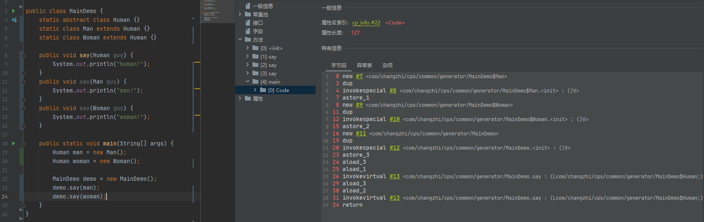
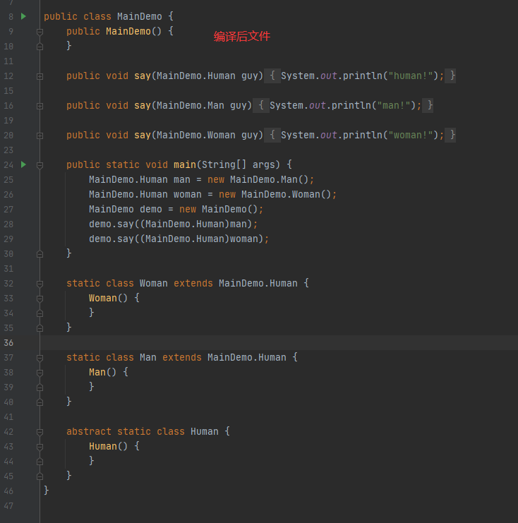
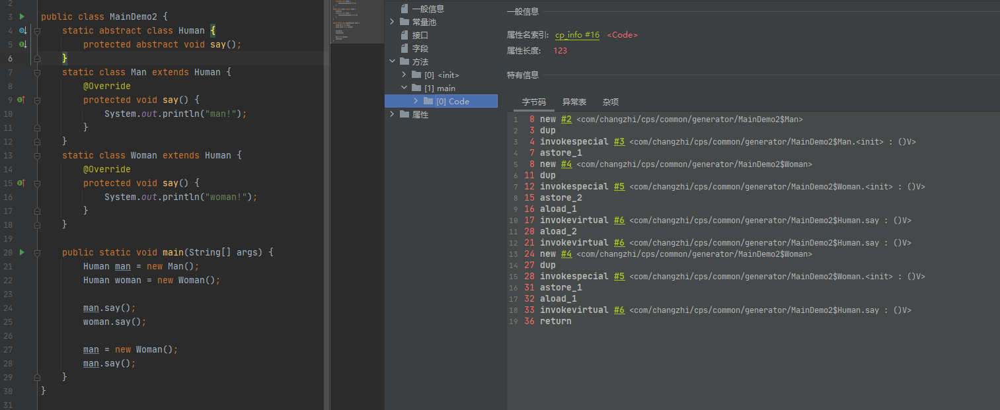
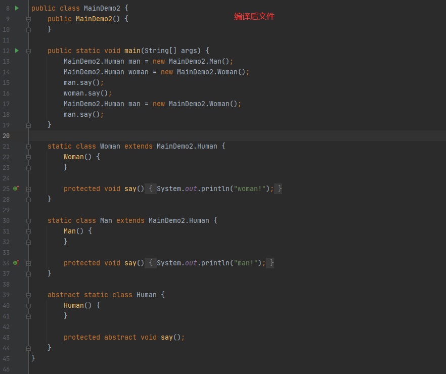
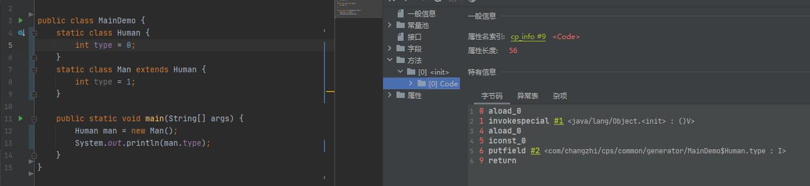

### 分派
分派，是用来确定执行哪个方法的过程。
Java三大特征中**多态**的最基本体现就是分派调用，如**重写**和**重载**。


#### 静态分派

静态分派，实际是根据参数的**静态类型**而不是实际类型，来定位方法调用的版本，该过程发生在编译期。
重载的本质就是静态分派，即在编译期就根据参数的静态类型确定了调用的方法。

```java
public class Demo {
    static abstract class Human {}
    static class Man extends Human {}
    static class Woman extends Human {}
 
    public void say(Human guy) {
        System.out.println("human!");
    }
    public void say(Man guy) {
        System.out.println("man!");
    }
    public void say(Woman guy) {
        System.out.println("woman!");
    }
 
    public static void main(String[] args) {
        Human man = new Man();
        Human woman = new Woman();
 
        Demo demo = new Demo();
        demo.say(man); // human!
        demo.say(woman); // human!
    }
}
```





Human man = new Man();

这里的Human，则被称为man对象的**静态类型**，而Man被称为man对象的**实际类型**。


#### 动态分派

动态分派，则是在运行过程中，根据实际类型来定位调用方法的版本。
重写的本质就是动态分派。

```java
public class Demo {
    static abstract class Human {
        protected abstract void say();
    }
    static class Man extends Human {
        @Override
        protected void say() {
            System.out.println("man!");
        }
    }
    static class Woman extends Human {
        @Override
        protected void say() {
            System.out.println("woman!");
        }
    }
 
    public static void main(String[] args) {
        Human man = new Man();
        Human woman = new Woman();
 
        man.say(); // man!
        woman.say(); // woman!

        man = new Woman();
        man.say(); // woman!
    }
}
```





方法重写行为，对应着JVM的invokeVirtual指令，该指令的解析过程如下：
1. 找到操作数栈顶的第一个元素所指向的实际类型，记为C

2. 如果在类型C中找到了与常量描述符和简单名称都相符的方法，则进行访问权限的校验，如果通过则返回这个方法的直接引用，查找结束，否则返回非法访问异常

3. 如果类型C中没有找到，则按照继承关系从下到上一次对C的父类做第2步的搜索和校验过程

4. 如果始终没有找到合适的方法，则抛出抽象反复错误的异常

从这个过程中可以发现，在第1步的时候就在运行期确定接收对象的实际类型，所以当调用invokeVirtual指令就会**把运行时常量池中的符号引用解析为不同的直接引用**，这就是重写方法的本质。


##### 动态分派是否对变量有效？
```java
public class Demo {
    static class Human {
        int type = 0;
    }
    static class Man extends Human {
        int type = 1;
    }

    public static void main(String[] args) {
        Human man = new Man();
        System.out.println(man.type); // 0
    }
}
```

根据输出结果可以看出，**动态分派是对变量无效的**。那从JVM指令的角度分析下，



由上图可以看出，该方法中并没有invokeVirtual指令，即该变量并没有参与多态。

