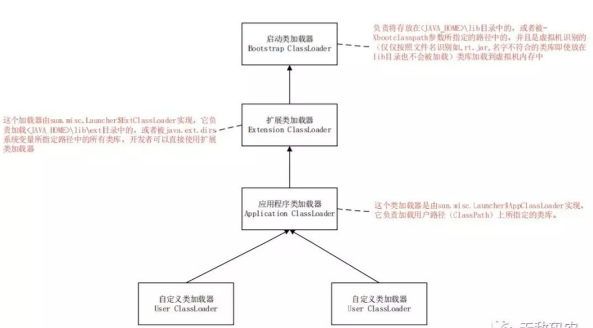

### 类加载器

这个String加载的是JDK提供的String？还是自定义的String？
```java
// 自定义String类
package java.lang;
public class String {
    static {
        System.out.println("自定义String");
    }
}

public class Test {
    public static void main(String[] args) {
        java.lang.String str = new java.lang.String();
    }
}
```


在整个类加载过程中，除了在加载阶段用户应用程序可以通过自定义类加载器参与之外，其余的动作完全是由虚拟机主导和控制的。

那么什么是类加载器呢？
在类加载的加载阶段中，把“通过一个类的全限定名来获取描述此类的二进制字节流”这个动作，是由JVM外部实现的代码模块来完成，这个模块称为“类加载器”。

从JVM的角度来看，只存在两种不同的类加载器：启动类加载器（Bootstrap ClassLoader）、其他类的加载器（独立于JVM外部，由Java语言实现的继承java.lang.ClassLoader的类型）
- 启动类加载器：由C++语言实现的，属于JVM自身的一部分；位于JDK目录下的lib文件夹中
- 扩展类加载器（Ext ClassLoader）：位于JDK目录下的lib/ext文件夹中
- 系统类加载器（App ClassLoader）：位于程序中classpath下
- 自定义类加载器（User ClassLoader）



如图可见，类加载器是有层次关系的，这种关系被称为类加载器的**“双亲委派模式”**，它要求除了顶层启动类加载器外，其余所有的类加载器都应当有自己的父类加载器，并且如果一个类加载器在收到类加载的请求之后都要先把这个请求委派给父类加载器去完成（每一个层次的类加载器都是如此，因此所有的加载请求最终都应该会传送到顶层的启动类加载器中），只有当父类加载器反馈自己无法完成这个加载请求（在搜索范围没有找到所需的类）时，子加载器才会尝试自己去加载。

简单来说，其工作原理：
1. 如果一个类加载器收到了类加载请求，它并不会自己先去加载，而是把这个请求委托给父类的加载器去执行
2. 如果父类加载器还存在其父类加载器，则进一步向上委托，依次递归，请求最终到达顶层的启动类加载器
3. 如果父类加载器可以完成类加载任务，就成功返回；倘若父类加载器无法完成此加载任务，子加载器才会尝试自己去加载


那么，是否可以打破双亲委派模式呢？答案当然是可以
双亲委派模式，其实现都是基于ClassLoader方法，因此，**如果重写 loadClass方法，指定类通过哪个加载器来进行加载，即改写了加载规则**，就相当于打破了双亲委派机制。

又或者可以通过**使用线程上下文类加载器**来完成打破双亲委派，即通过java.lang.Thread类的setContextClassLoader()方法进行设置，如果创建线程时还未设置，它将会从父线程中继承一个，如果在应用程序的全局范围内都没有设置过的话，那这个类加载器默认就是应用程序类加载器。
使用线程上下文类加载器去加载所需要的SPI（Service Provider Interface，服务提供者接口）代码，也就是父类加载器请求子类加载器去完成类加载的动作（打破双亲委派），例如JNDI、JDBC、JCE、JAXB 和 JBI等
